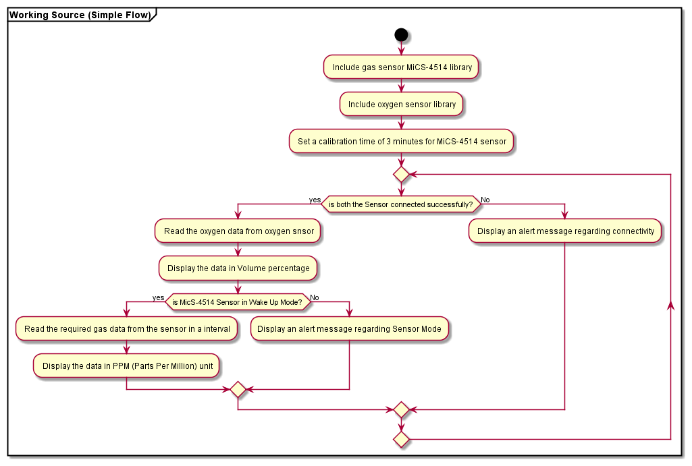

# Gas Level Measurement MiCS-4514
This is a gas level measurement using gas sensor (MiCS-4514) and Oxygen Sensor. We used Arduino Mega 2560 to read the data from sensors and to print those data on a serial monitor.

## The Sensor MiCS-4514 is capable of measuring the following types of gases and it's concentration:

    Gas              |  Formula   |  Concentration Range
    -------------------------------------------------------
    Methane          |  (CH4)     |  (1000 - 25000)PPM
    Ethanol          |  (C2H5OH)  |  (10   - 500)PPM
    Hydrogen         |  (H2)      |  (1    - 1000)PPM
    Ammonia          |  (NH3)     |  (1    - 500)PPM
    Carbon Monoxide  |  (CO)      |  (1    - 1000)PPM
    Nitrogen Dioxide |  (NO2)     |  (0.1  - 10)PPM

## Measuring Range of Oxygen Sensor:

- **Measurement Range:** 0~25%Vol

# Table of Contents
- [Repository Files](#the-repository-consists-of-following-files)
- [Connection Diagram](#following-is-the-connection-diagram-for-the-working-model)
- [Flow Chart](#following-is-the-flowchart-for-the-source)
- [Working](#working)
- [Version](#version)

# The repository consists of following files:

- **Assets:** 

    Assets are flowchart files. We created our flowchart for the task using Plantuml and stored it here.

- **Docs:**

    It contains various issues we faced while developing Source for the given task. It is useful for future purpose while debugging a same kind of issue.

- **Connection Diagram:**

    It is an image which represents a proper connection for the circuit to get our required output.

- **Source:**

    It is a working source for the task. It can be pulled and modified on any time in future.

# Following is the Connection Diagram for the Working Model:

- It is a simple connection between MiCS-4514, Oxygen Sensor and Arduino Mega 2560. The Vcc and GND pin of MiCS-4514 and Oxygen Sensor are connected to 5v and GND pin of Arduino Mega 2560 respectively for Sensor input.

- Similarly, the SDA and SCL pin of MiCS-4514 and Oxygen Sensor is connected to 20th and 21st pin (also known as SDA and SCL pin respectively) of Arduino Mega 2560 respectively.

# Following is the flowchart for the Source:

# Working

- As shown in [Connection Diagram](#following-is-the-connection-diagram-for-the-working-model), the MiSC-4514 sensor and Oxygen sensor uses I2C protocol for communication. Arduino Mega 2560 is used to transfer the data between board (Master) and the sensor(Slave). The MiSC-4514 sensor measures the concentration of various gases such as CO, NH3, C2H5OH, CH4, H2 and NO2 which presents in our environment. Similarly, The Oxygen sensor measures the oxygen content present in our environment in Volume Percentage. All these measured gas concentration and volume are read by Arduino Mega 2560. Finally using serial monitor, the values get by the Arduino board are displayed.

- To Make it more visible, a BUILDIN LED (Pin 13) is used to blink in various pattern based on the gas detected in sensor:

        •	Blink 1 time for detection of Carbon Monoxide (CO).
        •	Blink 2 times for detection of Methane (CH4).
        •	Blink 3 times for detection of Ethanol (C2H5OH).
        •	Blink 4 times for detection of Hydrogen (H2).
        •	Blink 5 times for detection of Ammonia (NH3).
        •	Blink 6 times for detection of Nitrogen Dioxide (NO2).
        •	Long Blink 2 times for detection of Oxygen (O2).

# Version:

- Gas Level Measurement v1.0.0-pre1 (2022/05/13)
- Gas Level Measurement v1.0.0 (2022/05/16)
- Gas Level Measurement v1.1.0 (2022/05/16)